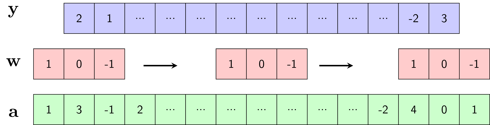
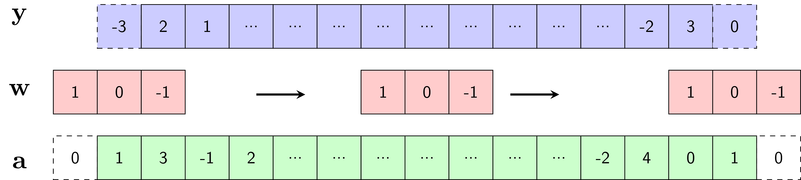
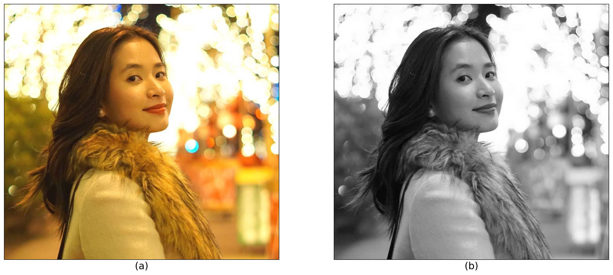
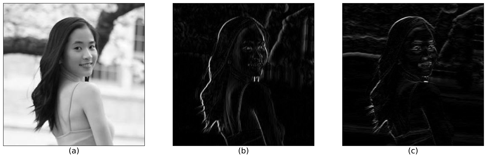
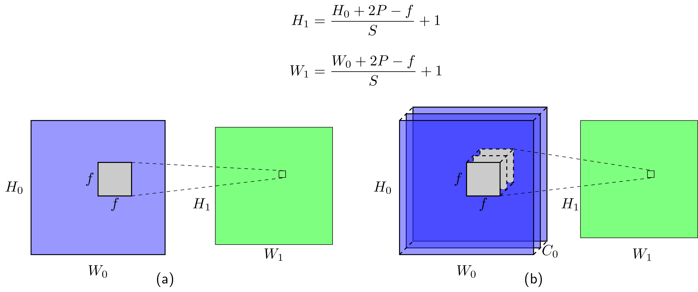

Tích chập đóng một vai trò quan và xuất hiện từ sớm 
trong lịch sử xử lý tín hiệu số. Việc tìm ra các bộ lọc phù hợp cho mỗi loại tín hiệu 
và mỗi bài toán đã được nghiên cứu và giảng dạy rất nhiều trong các giáo trình. 

Cuối những năm 1980s, Yann Lecunn đề xuất một mô hình tích chập hai chiều cho dữ
liệu ảnh và thu lại thành công lớn trong bài toán phân loại chữ số viết tay.
Bằng việc sử dụng rất nhiều dữ liệu và thay các _tầng nối kín_ (fully connected
layer) trong mạng perceptron đa tầng bởi tích chập hai chiều, các bộ lọc phù hợp
với bài toán và dữ liệu có thể được _học_ để mang lại kết quả phân lớp tốt nhất.


Trong bài viết này, tôi sẽ trình bày cơ sở toán học của tích chập một chiều và
tích chập hai chiều. 


## 1. Tích chập một chiều 

### 1.1. Định nghĩa 

Xét tín hiệu một chiều `a` có dạng hình sin như trong Hình 1a) được tạo bởi: 
```
import numpy as np
N = 200
x_clean = np.sin(np.arange(N)/20.)
```
--------

Hình 1

------

Tín hiệu này bị tác động bởi nhiễu Gauss: 
```python
x_noisy = x_clean + .05*np.random.randn(N)
```
Lúc này, tín hiệu không mượt nữa mà có dạng răng cưa như Hình 1b). 

Chỉ với một bộ lọc trung bình đơn giản, ta có thể thu được tín hiệu ít nhiễu hơn
như trong Hình 1c): 
```python
w = 1./3*np.ones(3)
x_filtered = conv1d(x_noisy, w) 
```
Ở đây, hàm `conv1d` thực hiện việc lấy tích chập giữa tín hiệu `x_noisy` và bộ
lọc trung bình `w`. Hàm số này sẽ được trình bày ở phần dưới. Trước hết, chúng
ta nhắc lại công thức tính tích chập một chiều trong xử lý tín hiệu số. 

Xét tín hiệu một chiều $a(n)$ và _bộ lọc_ (filter) $w(n)$. Tích chập của tín hiệu và bộ lọc
là một tín hiệu một chiều mới $b(n)$ được xác định theo công thức: 
$$b(n) = a(n)*w(n) = \sum_{k=-\infty}^{\infty}a(k)w(n-k)\quad \quad (1)$$


Trong mạng neuron tích chập, tích chập được định nghĩa khác đi một chút. Cho tín
hiệu đầu vào và bộ lọc lần lượt là các vector $\mathbf{a}\in \mathbb{R}^N$ và
$\mathbf{w} \in \mathbb{R}^f$ ($f$ có thể là một số tự nhiên bất kỳ nhưng thường
là số lẻ). Khi đó đầu ra là một vector $\mathbf{y}$ với từng phần tử được tính bởi: 
$$y_n = \sum_{i=0}^{f-1}a_{n+i}w_i\quad \quad (2)$$
với $n$ thỏa mãn $0 \leq n+i < N, ~\forall i = 0, 1, \dots, f-1$. Điều này tương
đương với $0 \leq n < N - f + 1$. Vậy $\mathbf{y} \in \mathbb{R}^{N-f + 1}$. 

Từ đây, khi đề cập tới khái niệm _tích chập_, chúng ta sẽ ngầm hiểu công thức
(2) đang được sử dụng. 

Cách tính tín hiệu đầu ra $\mathbf{y}$ được minh họa trong Hình 2. 


Hình 2: 

----------

Quá trình tính đầu ra $\mathbf{y}$ có thể được thực hiện như sau: 
1. Đặt bộ lọc $\mathbf{w}$ vào vị trí tương ứng với $f$ phần tử đầu tiên của
   $\mathbf{a}$. 

2. Nhân từng phần tử tương ứng của $\mathbf{w}$ và $\mathbf{a}$ rồi cộng các kết
   quả lại để được phẩn tử tương ứng của $\mathbf{b}$. 

3. _Trượt_ bộ lọc $\mathbf{w}$ một bước sang bên phải. Nếu phần tử cuối cùng của
   bộ lọc không vượt ra ngoài phần tử cuối cùng của tín hiệu, quay lại Bước 2.
   Ngược lại, dừng các bước tính toán. 

Trong ví dụ này 
$$y_0 = a_0w_0 + a_1b_1 + a_2b_2 = 1 - (-1) = 2, y_1 = a_1w_0 + a_2w_1 + a_3w_2
= 3 - 2 = 1$$ 

### 1.2. Thêm lề

Nhận thấy rằng kích thước của đầu ra $\mathbf{y}$ nhỏ hơn kích thước của đầu vào
$\mathbf{x}$ vì ta đang giả sử cả bộ lọc phải nằm trọn vẹn trong tín hiệu đầu
vào. 

Trong trường hợp ta muốn tín hiệu đầu ra có kích thước bằng tín hiệu đầu vào, ta
có thể giả sử giả sử tín hiệu đầu vào có thêm các giá trị bằng không ở hai phía.
Kỹ thuật này được gọi là _thêm lề_ (padding). Để có kích thước bằng nhau, tín
hiệu đầu vào cần được thêm $f-1$ giá trị bằng không. Khi $f$ là một số lẻ, mỗi
phía của tín hiệu vào thường được thêm $P = (f-1)/2$ giá trị bằng không.

Giá trị $P$ có thể là một số tự nhiên bất kỳ tùy thuộc vào từng trường hợp, $P$
không nhất thiết phải đảm bảo kích thước đầu ra và đầu vào của tín hiệu là như
nhau. Khi không sử dụng thêm lề, $P = 0$. 

Việc thêm lề được minh họa trong Hình 3. Khi $f = 3$, ta thêm $P=1$ ô bằng không
vào mỗi phía của $\mathbf{a}$. Khi đó $\mathbf{y}$ và $\mathbf{a}$ có kích thước
như nhau. 



Hình 3: Thêm lề. 

----------

### 1.3. Bước trượt 
Trong Hình 2, bộ lọc $\mathbf{w}$ được dịch sang phải một ô sau mỗi phép tính.
Trong một số trường hợp, ta có thể dịch bộ lọc đi nhiều ô sau mỗi phép tính. Số
lượng ô được dịch này được gọi là _bước trượt_ (stride), ký hiệu là $S$. Lúc
này, công thức tổng quát của (2) trở thành: 
$$ y_n = \sum_{i=0}^{f-1}a_{nS + i}w_i \quad \quad (3)$$ 

Trong trường hợp có sử dụng thêm lề với độ rộng lề mỗi phía là $P$, kích thước
đầu vào là $N + 2P$, giá trị $n$ trong $(3)$ cần thỏa mãn: 
$$0 \leq nS + i < N+2P, ~\forall i = 0, 1, \dots, f-1 \Leftrightarrow n \leq
\frac{N + 2P -f}{S}$$

Thông thường, $P$ và $S$ được chọn sao cho $\frac{N+2P - f}{S}$ là số nguyên.
Điều này kéo theo kích thước tổng quát của đầu ra khi có thêm lề và bước trượt
khác một là: 

------

$$N_1 = \frac{N + 2P - f}{S} + 1 \quad \quad \quad (4) $$

------
Công thức (4) rất quan trọng, chúng ta cần nhớ để thiết kế kích thước của các bộ
lọc, kích thước lề và bước trượt trong các mạng neuron tích chập. 

Tích chập một chiều có thể được thực hiện bằng numpy như dưới đây. Ở đây, hệ số
điều chỉnh `b` được thêm vào cho trường hợp tổng quát: 
```python
def conv1d(a, w, b = 0, stride = 1, pad = 0):
    """
    compute 1d convolutional (with bias)
    """
    w_old = a.shape[0]
    f = w.shape[0]
    a_pad = np.pad(a, pad_width=pad, mode = 'constant', constant_values = 0)
    w_new = int((w_old - f + 2*pad)/stride) + 1 
    a_res = np.zeros((w_new))
    for i in range(w_new):
        start = i*stride
        end = start + f
        a_res[i] = np.sum(a_pad[start:end]*w) + b 
    return a_res 
````

## 2. Tích chập hai chiều 


Tích chập được mở rộng ra cho trường hợp dữ liệu nhiều chiều. Trong phạm vi bài
viết, 
chúng ta sẽ dừng lại ở phép tính tích chập hai chiều với dữ liệu đầu vào chủ yếu
là ảnh. 

Cách tính tích chập hai chiều với các trường hợp thêm lề và bước trượt khác nhau
được minh họa trên Hình 4. Các ảnh động này được lấy từ tài khoản [Github
vdumoulin](https://github.com/vdumoulin/conv_arithmetic). 


<table style="width:100%; table-layout:fixed;">
  <tr>
    <td></td>
    <td></td>
    <td></td>
  </tr>
  <tr>
    <td>$P = 0, S = 1$</td>
    <td>$P$ bất kỳ, $S = 1$</td>
    <td>$P = (f-1)/2, S =1$</td>
  </tr>
  <tr>
    <td></td>
    <td></td>
    <td></td>
    <td></td>
  </tr>
  <tr>
    <td>$P = 0, S = 2$</td>
    <td>$P = (f-1)/2, S = 2$</td>
    <td>$\frac{N + 2P - f}{S} \notin \mathbb{N}$</td>
    <td></td>
  </tr>
</table>

Về cơ bản, bộ lọc (màu xám) trượt khắp tín hiệu hai chiều đầu vào (màu lam) theo thứ tự từ
trái qua phải, từ trên xuống dưới. Tại mỗi vị trí, các giá trị của bộ lọc và đầu
vào tương ứng được nhân với nhau rồi cộng lại để thu được kết quả đầu ra. Hệ số
điều chỉnh cũng có thể được thêm vào. 

### 2.1. Tín hiệu đơn kênh
Trong trường hợp tín hiệu đầu vào và bộ lọc là các ma trận hai chiều đơn kênh
(ảnh màu có thể được cọi là tín hiệu hai chiều với ba kênh, ảnh xám là tín hiệu
hai chiều đơn kênh). 
Cách tính tích chập có thể được thực hiện như sau: 
```python 
def conv2d_11(A, W, b = 0, stride = 1, pad = 0):
    """
    A: input, A.shape = (n_H_old, n_W_old)
    W: filter, W.shape = (f, f)
    """
    n_H_old, n_W_old = A.shape
    f, f = W.shape
    A_pad = np.pad(A, pad_width=pad, mode = 'constant', constant_values = 0)
    # new shape 
    n_H_new = int((n_H_old - f + 2*pad)/stride) + 1 
    n_W_new = int((n_W_old - f + 2*pad)/stride) + 1 
    # result
    A_res = np.zeros((n_H_new, n_W_new))
    # compute 
    for h in range(n_H_new):
        for v in range(n_W_new):
            h_start = h*stride 
            h_end = h_start + f
            v_start = v*stride 
            v_end = v_start + f
            A_res[h, v] = np.sum(A_pad[h_start:h_end, v_start:v_end] * W) + b 
    return A_res 

````

Ở đây ta giả sử rằng mối phía của tín hiệu hai chiều được thêm một đại lượng lề `pad` bằng nhau. Đoạn mã này có thể dễ 
dàng được mở rộng ra cho trường hợp thêm lề không đều. Tương tự, bộ 
lọc không nhất thiết vuông. Tuy nhiên, các trường hợp này ít xuất hiện trên thực tế.


**Giảm nhiễu, làm mờ ảnh** 

Tiếp theo, chúng ta cùng xem việc áp dụng các bộ lọc khác nhau vào bức ảnh trong
Hình 4b). Hình 4a) sẽ được sử dụng trong trường hợp đầu vào đa kênh. 


Hình 4: a) Ảnh màu, b) ảnh xám. 

------

Quan sát một ví dụ với việc khử nhiễu trong Hình 5. 


Hình 5: a) Ảnh có nhiễu. b) Giảm nhiễu bằng bộ lọc trung bình $f = 3$. c)
Giảm nhiễu và làm mờ với bộ lọc trung bình $f = 5$. 

------


Hình 5a) được tạo bằng cách thêm nhiễu Gauss vào ảnh xám: 
```python
img_noisy = img_gray + np.random.randn(*img_gray.shape)*20
```

Hình 5b) thu được bằng cách sử dụng bộ lọc trung bình với $f = 3$:
```
f = 3
w = 1./k**2*np.ones((f, f))
img_denoised = conv2d_11(img_noisy, w)
```

Bộ lọc được sử dụng là $w = \frac{1}{9}\left[\begin{matrix} 1 & 1 & 1 \\ 1 & 1 & 1 \\
1& 1 & 1\end{matrix}\right]$. Điều này nghĩa là giá trị của một điểm ảnh đầu ra
bằng trung bình cộng của hình vuông $3\times3$ có tâm tại vị trí tương ứng của
điểm ảnh đầu vào. Việc lấy trung bình giúp mỗi điểm ảnh đầu ra có giá trị không
quá khác biệt so với các giá trị xung quanh. Điều này gián tiếp giúp _giảm
nhiễu_. Một hiệu ứng phụ của bộ lọc trung bình là nó khiến bức ảnh ban đầu bị mờ
đi

Nếu thay một bộ lọc lớn hơn với $f = 7$, ta sẽ thu được kết quả như Hình 5c). Ta
quan sát thấy rằng các đường nét trên khuôn mặt không còn rõ ràng như hình 4b).
Bộ lọc này gián tiếp làm mờ thêm hậu cảnh ở vị trí ánh đèn phía sau cô gái.

**Dò cạnh** 

Dò cạnh của vật thể là một nhiệm vụ quan trọng trong xử lý ảnh. Hình 6 biểu diễn
kết quả dò cạnh thẳng đứng và nằm ngang trong ảnh bằng hai bộ lọc đơn giản. 


Hình 6: a) Ảnh xám gốc. b) Dò tìm các cạnh thẳng đứng trong ảnh. c) Dò tìm các
cạnh nằm ngang. 

------

Bộ lọc được sử dụng trong Hình 6b) là $w = \left[\begin{matrix} -1 & 0 & 1 \\ -1
& 0 & 1 \\ -1 & 0 & 1\end{matrix}\right]$. Giá trị điểm ảnh đầu ra (điểm tương ứng với
vị trí chính giữa bộ lọc) bằng tổng các điểm liền kề ở bên phải trừ đi tổng các
điểm liền kề ở bên trái. Giá trị này sẽ có trị tuyệt đối lớn nếu sự chênh lệch
giữa các điểm hai bên lớn. Điều này đồng nghĩa với việc giá trị ảnh đầu ra lớn
tại cạnh của vật thể. Đồng thời, nếu bộ lọc đang ở vị trí mà các điểm trong hình
vuông $3\times 3$ xấp xỉ nhau, giá trị điểm ảnh đầu ra tương ứng sẽ xấp xỉ
không. Trong Hình 6, các bức ảnh được hiển thị sau khi lấy trị tuyệt đối của ảnh
đầu ra. Các điểm ảnh màu đen (giá trị gần không) tương ứng với các khu vực đồng
nhất. Các điểm ảnh màu trắng (giá trị lớn) tương ứng với các cạnh. Trong trường
hợp này, chỉ các cạnh có phương thẳng đứng được tìm thấy. 

Để tìm các cạnh có phương nằm ngang, ta sử dụng bộ lọc $w = \left[\begin{matrix}
-1 & -1 & -1 \\ 0 & 0 & 0 \\ 1 & 1 & 1\end{matrix}\right]$ để thu được kết quả
như Hình 6c). 

Như vậy, chúng ta có thể thu được các phép biến đổi với ảnh thông qua các bộ lọc
đơn giản được xác định từ trước. Các bộ lọc này hoàn toàn có thể được tối ưu tùy
theo dữ liệu và bài toán.

## Tích chập hai chiều tổng quát

Trong trường hợp tín hiệu đầu vào đa kênh, ví dụ ảnh màu bao gồm ba kênh: đỏ,
lục, lam; mỗi kênh là một ma trận hai chiều. Giả sử kích thước của đầu vào là
$(H_0, W_0, C_0)$ với $C_0$ là số kênh. Khi đó, bộ lọc cũng có thể được mở rộng
ra với số kênh tương ứng để có kích thước $(f, f, C_0)$ (các kênh của bộ lọc không nhất thiết bằng nhau). Để
tính đầu ra, ta cũng trượt bộ lọc đi khắp ảnh, tính tích từng thành phần tương
ứng và lấy tổng toàn bộ các tích đó. Các tính với tín hiệu đa kênh được minh
họa trong Hình 7b). 



Hình 7: a) Tích chập hai chiều đơn kênh. b) Tích chập hai chiều đa kênh. 

----------

Tổng quát, giả sử đầu vào là một mini-batch của tín hiệu có kích thước $(m,
H_0, W_0, C_0)$.  Bộ lọc cũng ở dạng tổng quát với kích thước $(f, f, C_0, C_1)$
($C_1$ bộ lọc đa kênh). Khi đó, đầu ra sẽ là một mảng bốn chiều với kích thước
$(m, H_1, W_1, C_1)$. 

Ví dụ, nếu đầu vào là $m$ bức ảnh màu ba kênh với kích thước $(m, H_0, W_0, 3)$
thì đầu ra sẽ là $m$ _bức ảnh_, mỗi bức ảnh có kích thước $(H_1, W_1)$ và có
$C_1$ kênh. 

Việc tính tích chập hai chiều tổng quát có thể được thực hiện như sau: 
```python
def conv2d(A, W, b, stride = 1, pad = 0):
    """
    A: input, A.shape = (m, n_H_prev, n_W_prev, n_C_prev)
    W: filters, W.shape = (f, f, n_C_prev, n_C)
    b: biases, b.shape = (n_C_new)
    """
    assert A.shape[3] == W.shape[2], 'input.shape[3] must == filters.shape[2]'
    m, n_H_prev, n_W_prev, _ = A.shape 
    f, _, n_C_prev, n_C = W.shape 
    A_pad = np.pad(A, pad_width=pad, mode = 'constant', constant_values = 0)
    # new shape 
    n_H_new = int((n_H_old - f + 2*pad)/stride) + 1 
    n_H_new = int((n_W_old - f + 2*pad)/stride) + 1 
    A_res = np.zeros((m, n_H_new, n_W_new, n_C))
    # compute 
    for i in range(m):
        for h in range(n_H_new): 
            for w in range(n_W_new):
                for c in range(n_C):
                    h_start = h*stride 
                    h_end = h_start + f
                    v_start = v*stride 
                    v_end = v_start + f
                    a_slide = A_pad[i, h_start: h_end, v_start:v_end, :]
                    A_res[i, h, w, c] = np.sum(a_slide * W[:, :, :, c]) + b[c]
    return A_res 
```

## Kết luận 
Tích chập hai chiều tổng quát và các biến thể đóng vai trò quan trọng trong việc
xây dựng các mạng neuron tích chập. Các thành phần cơ bản của một mạng
neuron tích chập sẽ được đề cập trong bài tiếp theo. 